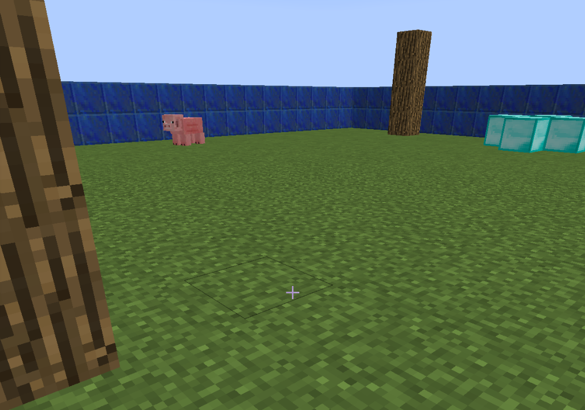
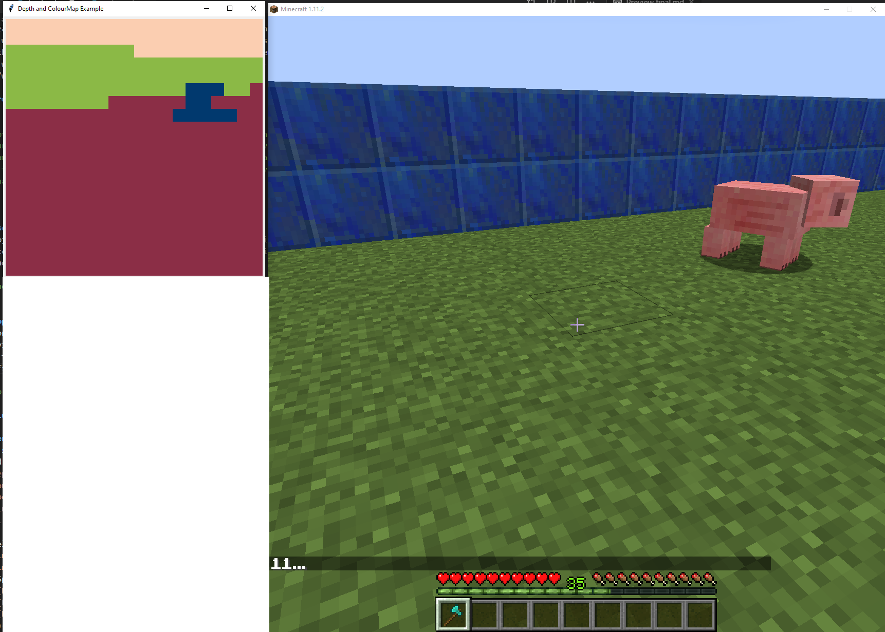
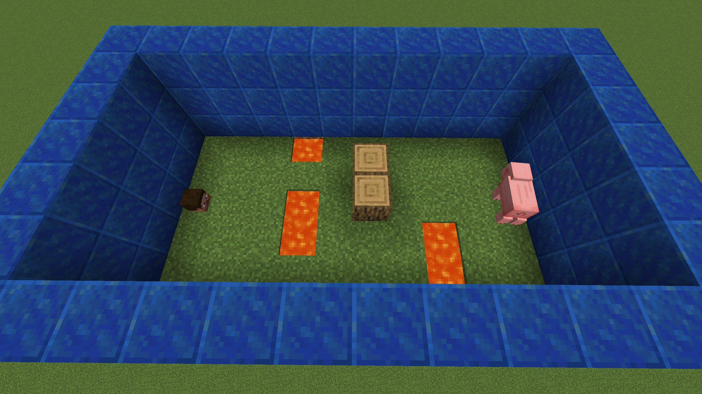
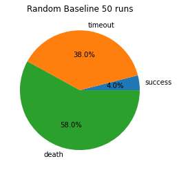
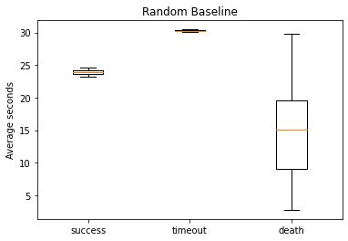
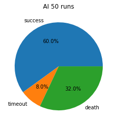
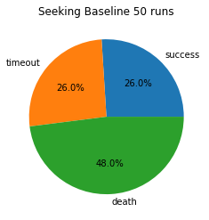
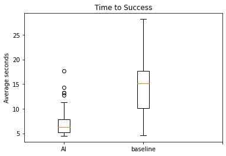

# Final Report

## Video

## Project Summary
<!---
Use another level-two header to start a Project Summary section. Write a few paragraphs
summarizing the goals of the project (yes, yet again, but updated/improved version from the status). In
particular, make sure that the problem is clearly defined here, and feel free to use an image or so to set up
the task. Part of the evaluation will be on how well you are able to motivate the challenges of the problem,
i.e. why is it not trivial, and why you need AI/ML algorithms to solve it
-->
The goal of our project was the creation of an agent which could find and catch pigs using only image input. The environment is limited to a 5x9 rectangle riddled with barriers and lava. The goal is for our agent to track and reach pigs before falling victim to traps or running out of time. The agent is measured in its reliability of killing pigs, in the time it takes to kill pigs, and the number of times it dies. Agents and baselines alike automatically hit pigs within its line-of-sight with a diamond axe to denote it reaching its goal. Two swift strikes of the axe slay the (virtual) beast!

  

When in uncluttered environments, the problem is fairly simple to solve: a perfect agent in this case would turn to locate a pig and walk straight towards it. Once lava, trees, and blocks are introduced, it becomes difficult for simpler agents to manage unexpected obstacle arrangements. This project also has myriad parallels in ongoing areas of research, such as how to train search and rescue robots to navigate rubble after natural disasters or self-driving car obstacle avoidance. Though this application is simpler and virtual, removing some variables, it is clear that problems such as these require more than naive implementations of path-finding algorithms. In our problem setup, we are careful to not give our AI more than a realistic agent might get - no descriptions of specific obstacles or how/where they appear. In the environment riddled with obstacles, a perfect AI would perform akin to a floodfill depth first search with a heuristic towards the pig's exact location, hit it, and track it through any of it's panicked movements.


## Approaches

<!--
Use another level-two header called Approaches, In this section, describe both the baselines
and your proposed approach(es). Describe precisely what the advantages and disadvantages of each are,
for example, why one might be more accurate, need less data, take more time, overfit, and so on. Include
enough technical information to be able to (mostly) reproduce your project, in particular, use pseudocode
and equations as much as possible.
-->
### Introduction
 The crux of the project is the use of colormap video frames. These are video frames which have blocks and entities colored uniformly in unique colors to simplify vision tasks. When considering the real world, it is akin to having an object detection/classification system to operate on image data before using it as input.

### Baselines
Our project evaluates the performance of two baselines: one which moves randomly in our environment without taking into account the observations at all, and one which uses the pig pixels' relative position on the screen to naively turn and walk towards it by centering the pig. 

The one which uses the naive approach works well with no obstacles, seeking and finding the pig. 

  

#### Colormap Introduction
The approach our project takes is that of an agent which uses Malmo's Colormap Video frames to move and turn through the environment. Colormap video frames is a video frame which has blocks and entities colored uniformly in unique colors to simplify vision tasks. When considering the real world, it is akin to having an object detection/classification system to operate on image data before using it as input.

Though this simplifies the problem and the observation space, use of continuous movement by the agent means that there are still a massive number of possible observations, especially considering noise such as pigs hurting, crosshair highlighting, and lava sparks.

  

*Top left is what the colormap video looks like, right is the real minecraft environment. Lapis blocks are green, grass is red, and the pig is blue in the colormap video.*

### Proposed Solution
#### Raw Pixel Data
The approach our project takes is that of an agent which uses Malmo's Colormap Video frames to move and turn through the environment. This is meant to emulate simplfied camera data in a real robotic agent trying to overcome obstacles to get to a goal. Concretely, we use a PPO (Proximal Policy Optimization) Reinforcement Learning Algorithm with a fully connected neural network function approximator. The input is a 20x20x3 RGB image which is flattened before being input to the neural network. 

The neural network has two hidden layers of 256 nodes each, using a hyperbolic tangent (tanh) activation function. It also has a value function which mirrors the primary neural network architecture.

The algorithm was trained on an environment with obstacles of lava and logs in fixed positions to learn about the hazards and how to avoid them. The goal, as with the evaluation, was to attack and kill the pig. It was trained for approximately 3 hours and 280 epochs on one environment, and another 2 hours on a different one. 

Since the agent is trained on a fixed environment with no randomness, it is possible to overfit the example environment. For example, if the agent learns that it can avoid logs by moving around it to the left, but there is eventually a log next to the wall, the agent would fail to recognize that it cannot avoid the obstacle by avoiding it to the left. This can be overcome to some extent by further honing the training environment, or augmenting a previously-trained model with a new environment.

PPO Algorithm (Schuman et al.):
```
for each iteration:
    Run old policy based on theta_old in environment for T timesteps
    Compute advantage estimates A_hat_1 ... A_hat_t
    Optimize surrogate loss with respect to theta for each epoch and minibatch
    Update theta_old with a new theta
```

Rewards:
 <!-- 
 * -1 * (Movement speed [-1, 1]) * 5
 * -1 * (Turn speed [-0.5, 0.5]) * 20 
 -->
 * -20 per time step
 * (1 - np.exp(- # of pig_pixels)) * 30
 * +600 for each time the agent damages the pig
 * -1000 for dying
 * -1000 for running out of time
 * reward -= 3 * (count of steps) for staying in an already visited block
 * reward += 50 for visiting a previously unseen block
 * 600 - duration * 15

Action Space:
 * [0, 0.75] movement speed
 * [-0.5, 0.5] turn speed

<!-- #### Raw Pixel Data + Strafe Action Space
This is a slightly modified agent with the ability to move laterally without shifting the field of view. The previous agent has a simplified action space, in order to "move left" one would first have to "turn left" then "move forward" instead of being able to "move left" while still facing forward.

Rewards: Same as above

Action Space:
 * [0, 0.75] movement speed
 * [-0.5, 0.5] turn speed
 * [-1, 1] strafe speed -->

<!--
Need to add other approach of simplified space if that works
-->
## Evaluation
<!-- 
An important aspect of your project, as I’ve mentioned several times now, is evaluating your
project. Be clear and precise about describing the evaluation setup, for both quantitative and qualitative
results. Present the results to convince the reader that you have solved the problem, to whatever extent you
claim you have. Use plots, charts, tables, screenshots, figures, etc. as needed. I expect you will need at least
a few paragraphs to describe each type of evaluation that you perform. 
-->
Evaluation was performed by qualitatively and quantitatively by applying trained models in different environments. These environments were:
 * An open world environment
    * Pigs and obstacles are spawned in at random in a 20x20 grid.
 * A 5x9 obstacle course to be completed in a maximum of 30 seconds
    * Player and pig spawn at far ends of the rectangle
    * 3 rows of hazards (blocks or lava) are randomly generated and placed between them
        * Rows have at most 3 / 5 blocks filled with hazards
        * Hazard rows are separated by a row of normal dirt blocks


The quantitative measurements we used in evaluation were
 * How long it took to kill a pig (Mission duration)
 * Percentage of runs ending in death, time-out, and success

### Obstacle Course Environment
  

The baselines and our proposed PPO AI were set to perform the "obstacle course" to kill the pig. Keep in mind that the pig, after hit once, panics and moves sporadically through the course, introducing a lot of randomness. Since the obstacles are also in randomized positions through runs, one can consider this a fairly general experiment. 

Random Baseline: 

  

These results are for the agent which moves forward and turns randomly. Each trial's outcome was noted as success (killing the pig), timeout (using up the allotted 30 seconds), or death. In 50 runs only two were successful, establishing a minimum value for successes. Of the other runs, 19 were timeouts and a whopping 29 were deaths by meandering into either lava or the fire which has a chance to randomly spring up.

  

Here is plotted the time it took to reach each outcome. For example, since timing out took 30 seconds, the complete box plot of timing out is slightly above 30. Both of the successes for this random baseline were in the high 20s, implying that the randomized baseline is, as expected, not taking a very direct path towards the pig. On the other hand, the time it took to die is fairly well distributed throughout the time, also to be expected of random wandering.


AI vs Seeking baseline: 

    

Now that the graph format has been introduced and the baseline established, we can compare the AI and the naive seeking baseline. In these pie charts, we can see that the AI has over double the success rate of the seeking baseline, and dies about a third less often. These are very reasonable results for an AI facing a random set of obstacles, an almost infinitely large observation space, and random pig movement.

  
This graph is slightly different than that of the randomized baseline: comparing instead of holistically visualizing times to reach states. Here, you can see that the AI is finding and killing the pig not just more consistently, but also significantly faster than the seeking baseline. This is in spite of the seeking baseline attempting to follow a direct path to the pig. Concretely, the average time to success of the AI was 7.65 seconds, while the average time for the seeking baseline is 14.53 seconds. Our AI is not just more consistent, but also quicker than our baselines.


## References
During some parts of development, particularly designing reward functions, learning rates, the network, and evaluation we used primarily:  
 * [Deep Reinforcement Learning Robot for Search and Rescue Applications: Exploration in Unknown Cluttered Environments](https://ieeexplore.ieee.org/document/8606991)  
 * [Robotic Search & Rescue via Online Multi-task Reinforcement Learning](https://arxiv.org/abs/1511.08967)  
 * [Reinforcement learning in robotics: A survey](https://journals.sagepub.com/doi/full/10.1177/0278364913495721)  
as well as a couple other less applicable papers.
 * [PPO OpenAI paper (‎Schulman et al.)](https://arxiv.org/pdf/1707.06347.pdf)

In development, we used 
 * [Malmo XML Documentation](https://microsoft.github.io/malmo/0.30.0/Schemas/MissionHandlers.html)
 * [Malmo Python Examples](https://github.com/microsoft/malmo/tree/master/Malmo/samples/Python_examples) 
    - Specificially..
    - [Hit test](https://github.com/microsoft/malmo/blob/master/Malmo/samples/Python_examples/hit_test.py)
    - [Radar test](https://github.com/microsoft/malmo/blob/master/Malmo/samples/Python_examples/radar_test.py)
    - [Depth map runner](https://github.com/microsoft/malmo/blob/master/Malmo/samples/Python_examples/depth_map_runner.py)
 * [Ray/RLLib Documentation](https://docs.ray.io/en/master/rllib.html)
    - In particular
    - [Custom Models](https://docs.ray.io/en/stable/rllib-models.html#custom-models-pytorch)
    - [Visionnet.py](https://github.com/ray-project/ray/blob/master/rllib/models/torch/visionnet.py)
 * [PPO Hyperparameter RL medium article](https://medium.com/aureliantactics/ppo-hyperparameters-and-ranges-6fc2d29bccbe)
 * [PPO explained](https://jonathan-hui.medium.com/rl-proximal-policy-optimization-ppo-explained-77f014ec3f12)
 * [RL Function approximation article](https://towardsdatascience.com/function-approximation-in-reinforcement-learning-85a4864d566)
 * And of course, class examples for RLLib with Malmo
