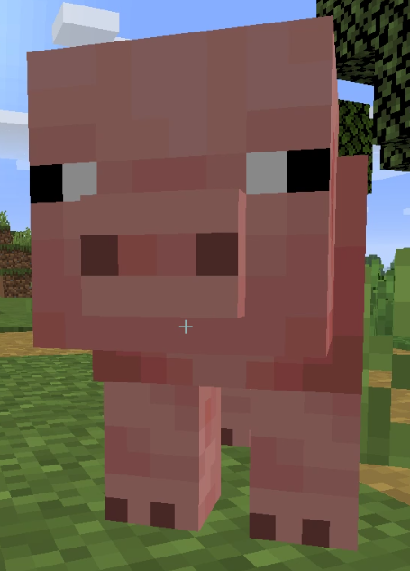

[Source code](https://github.com/kchian/MAI_Project)

Reports:

- [Proposal](proposal.html)
- [Status](status.html)
- [Final](final.html)

Our team spawns in a discord server every Monday at 10AM.

The goal is to train a reinforcement learning agent to locate, track, and reach a pig around obstacles like trees and lava.
  
 
As a first step, we evaluated our AI purely on its ability to stay on the platform and touch a tree we place in a 10x10 floating world. The baseline in this scenario would be an AI that doesn’t do anything and wanders aimlessly. Our AI uses Malmo’s ColourMap Video Producer to get RGB frames where each block type is assigned a unique color. These frames were used to determine whether the agent was looking towards a tree. If it was, a reward of +10 was given. Here the AI will be able to turn left/right and move forward. The AI would ideally learn to turn around to find the tree, similar to a radar. Once it finds the tree, walks towards it, and touches it, the mission ends in success and a reward of +10000 was given. However, if it fell off the map, the mission ends in failure and a reward of -10000 was given. Later, we changed this to -200 to fall off to discourage running in circles to merely stay alive.

As a variation of this, the AI was placed in a 50x50 world with 10 trees, enclosed by a lapis-lazuli block wall. The agent was rewarded for getting closer to the tree and penalized for getting further away from the tree, alongside the tree-locating reward from the first step. It was also penalized for touching the lapis-lazuli wall. The reward structure is as follows: -1 for touching the lapis-lazuli wall, -1 for getting too far from a tree, +1 for getting within 10-5 steps of a tree, +4 for getting within 5 steps of a tree and +100 for touching a tree. Again, the AI will be able to turn left/right and move forward. Also, the mission ends in success when a tree is touched. However, with the addition of the wall, we decided that if the AI takes 100 steps without touching a tree, the mission ends in failure. We expect that some time in this new environment, the AI will be able to adjust and begin walking towards trees with great accuracy. The increased number of trees allows for a more consistent locating ability by the agent.

Since the framework is already up and running, next steps to get the agent up and hunting pigs. We would increase the action space with more perspective turning and the ability to attack, introduce some static obstacles, and improve the convolutional neural network function approximator to help the agent understand its observations. We haven’t solidified a reward structure yet but we plan to have this: +P for putting the pig in the center of the screen,  -P for being too far from the pig, +P for getting within 10-5 steps of the pig, +P for getting within 5 steps of the pig and +P for hitting the pig. Here if the agent kills the pig within a time limit, the mission is a success. If the time limit is reached and the pig lives, the mission ends in failure.
