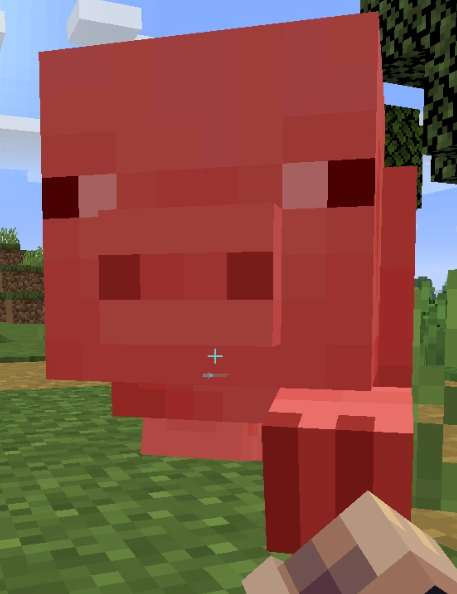

[Source code](https://github.com/kchian/MAI_Project)

Reports:

- [Proposal](proposal.html)
- [Status](status.html)
- [Final](final.html)

Our team spawns in a discord server every Monday at 10AM.

The goal is to train a reinforcement learning agent to locate, track, and reach a pig around obstacles like trees and lava.

 
