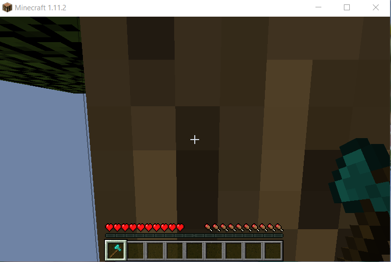

## Watch the Status Report
 
  
## Project Summary
There are several iterative goals for this project. Our first goal, presented in this status report, is to have Steve find a tree, since locating and learning to chase a stationary target is perfect for a prototype. This environment is a 10x10 floating grass island populated by one tree. He may be facing in a direction where there are no trees so Steve will have to turn to locate a tree before walking to touch it. Our goal for the final project is a pig-catcher. Our agent will start in a 50x50 world with 15 pigs spawned randomly throughout the world, alongside various sparse obstacles such as blocks or trees. The goal is for our agent to track and reach pigs before falling victim to traps, running out of time, or otherwise dying. This contrasts with our initial idea, which was to learn how to mine a tree in a plain 10x10 dirt floating island.
  
## Approach
For our general approach we have used a Q Network to determine the best action given the environment. The network is updated using adaptive moment estimation (ADAM). Adam uses estimates of the first and second moments of the gradient. 

β is the rate of decay for the past estimates. The moments are then divided by 1 - β in order to correct for bias. 

Finally, the values are used to update each weight of the network.

The network takes the rgb input as 3 channels of 800 by 500, supplied by a ColourMap Video Producer. This gives an image where each unique block type is given its own flat color instead of a complex texture. The input is then modified through a series of two convolutional layers, dropout, and two fully connected layers. The network gives three different values as output, each corresponding with a different action. The 3 actions are "move 0.5", "turn 0.25", and "turn -0.25". We learned that the agent wouldn't need to stop when moving towards the tree and wanted to simplify the model as much as possible so we chose to stick with just these three outputs. The speeds of the actions are lowered from one in order to obtain more input frames per action interval. The agent is allowed to move continuously through the environment using these actions. The networks receives negative rewards when the agent moves off the platform and positive rewards for when the agent looks at or touches the tree. The network also receives a reward based on the distance between the agent and the tree.

We have tried several modifications to improve our performance. One modification was to add more trees to the environment and slowly reduce the number of trees as training continues. The rationale behind this decision was that using a single tree means that the agent isn't very likely to come in contact with the tree. In addition, the rate at which frames were input to the agent was too low, meaning the agent often skipped over looking at trees. By increasing the reward, the agent will come in contact with more trees which could reduce the amount of time needed for the agent to make the correlation between a tree and a positive reward. Another modification was to remove pooling and simply use larger kernel sizes in the convolutional layers. This modification reflects the current trend in state of the art systems. We also tried adding a barrier with a negative reward to the edge of the environment so that the agent would be able to train longer instead of falling off the side. One of the more effective modifications we made was to the rewards provided to the network. At first we had a -10000 reward for falling off the edge and a 10000 reward for touching the tree. This led to the agent prioritizing staying on the platform instead of trying to reach the tree. Instead of having a moving agent we instead had an agent that would spin in circles for the duration of each episode. After lowering the reward for falling off the edge to -200, we were able to get a better performing agent. 
  
## Evaluation

The most important result that we evaluated our agent on was success rate. The success rate is the percentage of trials that were completed by the agent touching the tree. In a single tree environment a random agent has less than a 2% success rate. Our best agent was able to reach a 7% success rate. While there is a lot more progress to be made, we are encouraged by the imporvement in our agent. In the multitree environment with 10 trees a random agent reaches has a little more than a 3% success rate. We were able to train an agent with around a 70% success rate.

 

Another way we evaluated our agent was through its death rate. This evaluation method was only applicable to the agent in the environment with no wall. The death rate is the percentage of trials where the agent falls off the edge of the map. A random agent falls off the map almost 90% of the time. Our trained model only falls off the map a little more than 10% of the time. This evaluation method is a little flawed in determining how the agent is progressing towards the goal of reaching the tree. In some instances, we have observed the agent spinning in circles instead of moving around, presumably in order to avoid falling to its death.

The last quantitative way we evaluated our agent was through its return values. A higher return value means the agent is doing well and a lower return value means it is not doing as well. The average return value was not such a great indicator of performance since the positive reward for touching the tree was very high and would greatly skew the reward. Instead, we looked through the history of rewards and looked to see if we could find a higher concentration of positive rewards further into training.

We evaluated our agent qualitatively by watching it in the environment. We watched to see if our agent seemed to find the tree or just look around aimelessly. We watched to see if the agent would move towards the tree instead of away from it. We watched to see what happened when our agent got closer to the tree. We wathced to see if our agent spend a lot of time falling off the edges or walking into walls.

The qualitative analysis gave us a lot of insight into our agents performance. When training our agent on a platform we noticed that it would spin in circles to avoid falling off the edge. When the agent was placed closer to the tree it would pan back and forth to get the reward for looking at the tree but it would not take the initiative to move on its own and relied on a random decision to move in order to do so. These observations prompted us to tweak the rewards which led to better performance in our agent. 

*Many of our rate are rounded. This was done due to the lack of evaluation trials run for the agents. Most agents were evaluated in less than 200 episodes.
  
## Remaining Goals and Challenges
Our prototype is limited in a number of ways right now, but the path to completion is fairly clear. Obviously, finding a tree is slightly simpler than finding a moving pig. More important is the improvement of both the reinforcement learning and the neural function approximator. Right now, we used the same framework provided by the course, but we plan to move to RLlib once given the chance. More tuning for the neural function approximator is also in our sights. More concretely, we've had iterations of our AI which perform extremely well given a bit more help - extra trees while training for example. However, to make it a complete contribution, more work must be done on model robustness and reliability for us to start working on tracking a pig.

The primary challenge we expect to face is recognizing the pig as something to chase. It will likely be quite difficult to simply chance upon a pig to catch and begin learning with. To remedy this, we may start by doing similar things as trees - including more pigs in first iterations to help accelerate learning, or by coding a reward relating to how much pig is kept in frame. Once we get here, the obstacles will likely pose a problem for tracking the pig, and we plan to remedy this by tuning the neural network architecture to better recognize partial sections of the tree.

As a simple baseline, one could use a relatively simple scan + move towards pig-colored pixels after calculating angle of attack through trigonometry. Should this be done at every interval, one could have a very simple agent which doesn't avoid obstacles and probably gets stuck, but would work to track a pig naively.
  
## Resources used
So far, we have mostly used class resources and Malmo samples for our program. This iteration of our architecture, since we hadn't had time to implement RLlib yet, was based primarily on the framework from assignment two. As a result, we also used PyTorch. Other resources include the [depth_map_runner](https://github.com/microsoft/malmo/blob/master/Malmo/samples/Python_examples/depth_map_runner.py) and [radar_test](https://github.com/microsoft/malmo/blob/master/Malmo/samples/Python_examples/radar_test.py) examples from Malmo, providing the "documentation" for ColourMapProducer and the framework for our frame visualization window. Other than that, no major resources were used.

-Malmo
-Pytorch
-Malmo Pig Example 
https://github.com/microsoft/malmo-challenge/tree/master/ai_challenge/pig_chase
-CNN and Pooling
https://d2l.ai/chapter_convolutional-neural-networks/pooling.html
